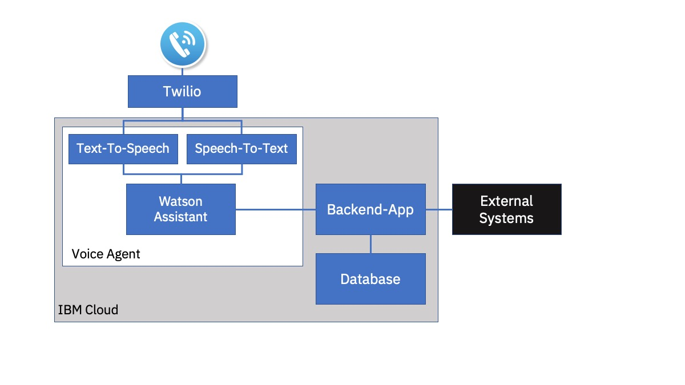
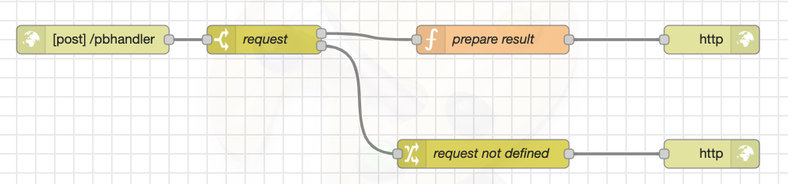

# Phonebot with IBM Voice Agent and Backend Integration

Phonebots ca help businesses to provide information and answer simple questions. This tutorial can be used to build a first prototype, develop the phone dialog, and test the components. 

## Solution Overview
The solution consist of the following components
- the Voice Agent (Watson Assistant service, Speech-to-Text service, Text-to-Speech service)
- the Twilio platform (other platforms possible)
- a basic backend application
- a database (not yet implemented, only needed if data needs to be stored for some reason)

The phonebot can answer basic questions (e.g. FAQs). The backend integration can be used to provide current information from external systems (e.g. emergency updates). 
## Prerequisites
- IBM Cloud account
- Twilio account
- basic knowledge of the components being used

## Instructions

- get a [virtual phone number](https://www.twilio.com/phone-numbers) from Twilio
- install Node-RED on the IBM Cloud and import the [flow](Node-RED-Flow.json), see [A SHORT INTRODUCTION OF THE NODE-RED STARTER KIT ON IBM CLOUD FOR HACKATHONS](https://suedbroecker.net/2020/03/09/a-short-introduction-of-the-node-red-starter-kit-on-ibm-cloud-for-hackathons/) for instructions
- create a [Watson Assistant](https://cloud.ibm.com/docs/services/assistant?topic=assistant-getting-started#getting-started) service and import the Watson Assistant skill file [skill-Phonebot.json](skill-Phonebot.json)

Now you can already try out and adapt the dialog, but not yet prgrammatic calls of the backend. That will be configured in the next steps:
- modify the webhook address , which is the address of the Node-RED instance
- install the IBM Voice Agent service as described in this [video](https://www.youtube.com/watch?v=ztOme26gVuA&t=308s) and on this [guide](https://cloud.ibm.com/docs/services/voice-agent?topic=voice-agent-getting-started)

I chose the option to create all in one step and could select the existing Watson Assistant service and skill.

## Backend Application
The Backend Application is simple:

Depending on the paramater *request* a specific action is triggered. 
